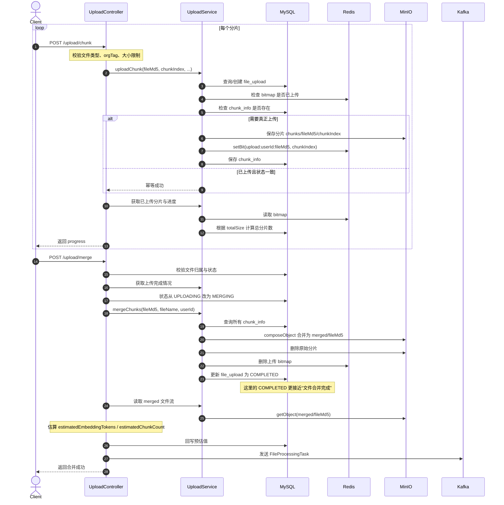
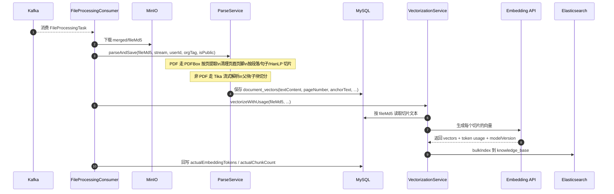

# PaiSmart 上传与解析时序图（简化版）

这版按 `PaiSmart` 当前真实实现拆成两张图：

- 第一张只看“上传与合并”
- 第二张只看“异步解析与入库”

这样比一张特别宽的总图更容易看清。

---

## 1. 上传与合并

---

## 2. 异步解析与入库

---

## 3. 一句话理解

第一张图解决的是：

- 文件怎么可靠上传
- 分片怎么落存储
- 什么时候合并成完整文件
- 什么时候发异步任务

第二张图解决的是：

- Kafka 任务怎么被消费
- 文档怎么解析和切片
- 切片文本先落哪
- 向量最后写到哪

